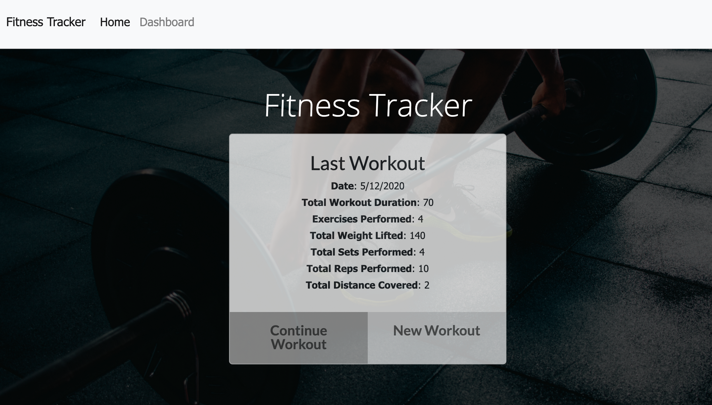
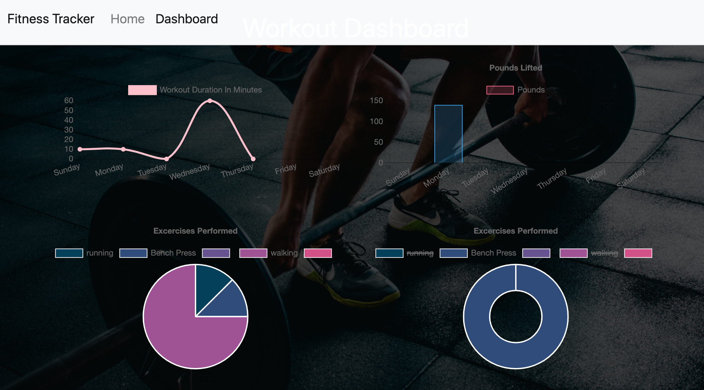
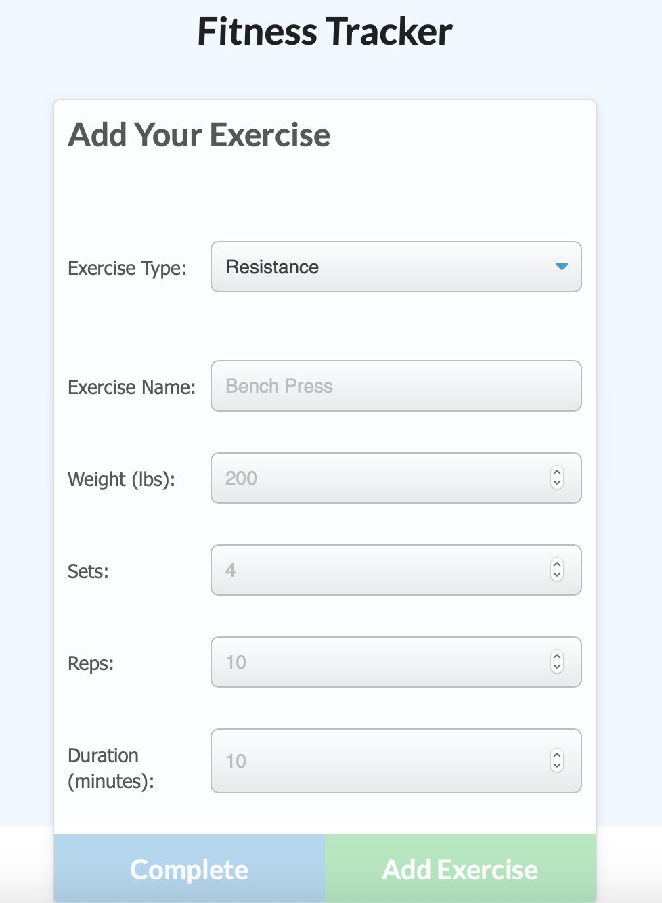

# This is the link to deploy. Using Heruko to run the app.

https://mysterious-peak-04692.herokuapp.com/

# This is the link to the github repo:
https://github.com/SINCHOCHAN/fitness

# This is the link to the live website:

https://sinchochan.github.io/fitness/

# How to run (screenshot)

# PROJECT TITLE
Unit 17 Nosql Homework: Workout Tracker

## Description
As a user, I want to be able to view create and track daily workouts. I want to be able to log multiple exercises in a workout on a given day. I should also be able to track the name, type, weight, sets, reps, and duration of exercise. If the exercise is a cardio exercise, I should be able to track my distance traveled.

## Business Context
A consumer will reach their fitness goals quicker when they track their workout progress.

## Acceptance Criteria
When the user loads the page, they should be given the option to create a new workout, or continue with their last workout.
The user should be able to:

Add exercises to a previous workout plan.
Add new exercises to a new workout plan.
View multiple the combined weight of multiple exercises on the stats page.

# How to run (screenshot)
